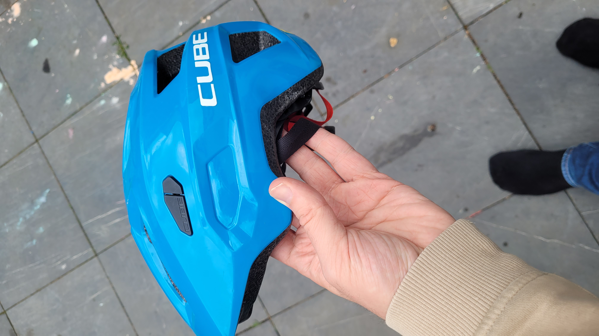
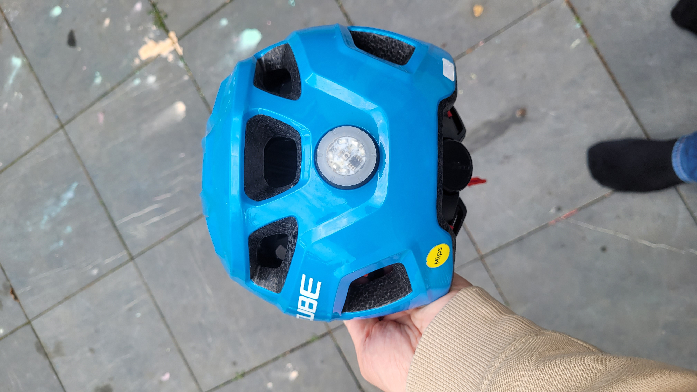
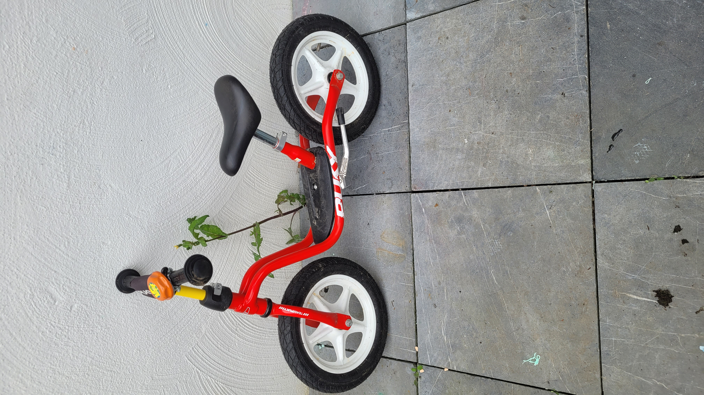

# Biking

## Table of contents

- [Bobby Car](#booby-car)
- [Helmets](#helmets)
- [Balance bike](#balance-bike)
    - [References](#references)
- [Tricycle](#tricycle)
- [Kids bike](#kids-bike)

## Bobby Car

With the beginning of walking their first steps, kids can get their first non-motorized vehicle.
We started with the [Bobby Car](https://www.amazon.de/s?k=bobby+car) and a [balance bike](https://www.amazon.de/s?k=balance+bike).
Which is probably a very german thing to do, because the Bobby Car and the balance bike are very popular here.

## Helmets

Helmets are a must-have on every wheeled vehicle.
You may don't think they will fall, but they will.
And they can be faster than you think.

Especially if you want to do night tours, you should get a helmet with a light on it.
These are often integrated in kids helmets, but should be checked before buying one.

I would also recommend to get into a bicycle store and get an expert on this matter.
They often have a lot of experience and can help you with the right choice.

## Balance bike

The balance bike is a great way to learn how to balance on two wheels.
If you start early, it really helps with the transition to a normal kids bike.
Learning about balance, gravity, and speed is a great way to start biking.

A very big bonus they are fast as or even faster than walking. So you can have a nice normal paced walk with your kid on the balance bike.

You can start with a balance bike as soon as your kid can walk.
They may need time to get used to it, but they will get the hang of it, if they try repeatedly.
Don't forget your [helmet](#helmets).

If your kid feels safe and comfortable on the balance bike, you can start with a normal kids bike.
The best indicator for this is if your kid can lift their feet and balance on the bike.

### References

- [Wikipedia - Balance bike](https://en.wikipedia.org/wiki/Balance_bicycle)
- [Study by the NIH](https://www.ncbi.nlm.nih.gov/pmc/articles/PMC9310799/)

## Tricycle

Honestly, we didn't have a tricycle. But if your kid has an affection to this vehicle
you should definitely get one.

## Kids bike

TO BE CONTINUED (We are currently in this phase)