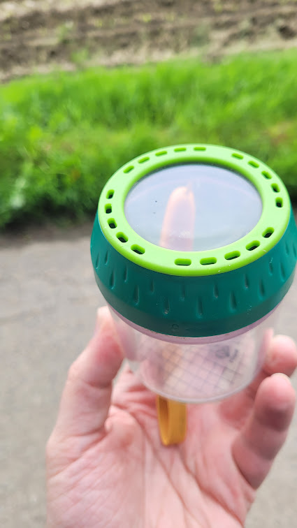

# Insects

Exploring wild life is pretty exciting for kids. They will learn a lot about nature and animals. Insects are a great way to start with.
They are everywhere, and you can find them in your garden, in the park, or in the forest.

A great way to observe insects is an insect glass. You can catch them and observe them for a short time. But don't forget to let them go after a while.

These glasses can be found in every toy store or online. But you can also make one yourself.
Just take a glass and a piece of paper, and you are good to go. Don't forget to poke some holes in the paper, so the insects can breathe.

gi